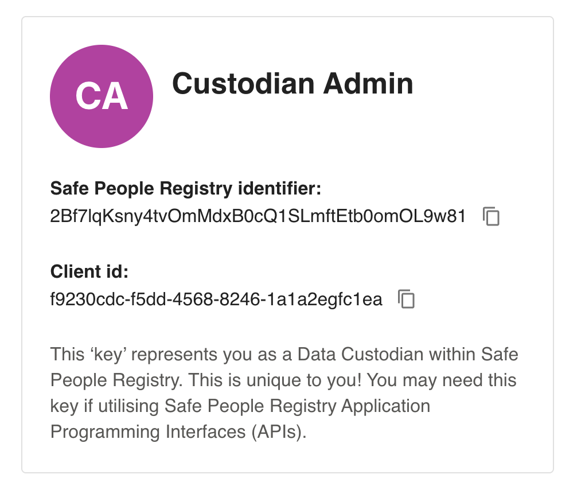

[](https://github.com/HDRUK/spr-signed-payload-generator-examples/blob/main/LICENSE)
[](https://hdruk.ac.uk)

# Safe People Registry – Signed Payload Generator Examples

This repository provides example implementations for generating **signed payloads** required to authenticate with the **Safe People Registry API** at a server-to-server level.

The examples demonstrate how to create an HMAC-SHA256 signature using a shared secret, which is then sent with each API request to securely verify the caller.

Examples are provided in:
- Node.js
- Go
- Python

---

## API Authentication Overview

All API requests to the Safe People Registry **must** include the following HTTP headers:

Accept: application/json  
Content-Type: application/json  
x-client-id: <your client id>  
x-signature: <your signed payload>

- `x-client-id` identifies your custodian account  
- `x-signature` is a Base64-encoded HMAC-SHA256 signature of the request payload  

---

## API Environments

The Safe People Registry APIs are available in the following environments:

- Development  
  https://api.registry.dev.hdruk.cloud/api/v1/

- Pre-production  
  https://api.registry.preprod.hdruk.cloud/api/v1/

- Production  
  https://api.registry.prod.hdruk.cloud/api/v1/

---

## Custodian Endpoints

The following endpoints are exposed specifically for use with **Custodian keys**:

Route: `validate/`  
Method: POST  
Body:
{
  "email": "<email_to_verify>"
}

Route: `query/`  
Method: POST  
Body:
{
  "ident": "<user_digital_identifier>"
}

---

## Obtaining Your Client ID

1. Sign in as your **Custodian user**
2. Visit the homepage
3. Copy your **Client ID**

This value will be used as the request header:

x-client-id: <your client id>



---

## Generating a Signed Payload

This repository includes example implementations for generating the required payload signature in Node.js, Go, and Python.

Decide which example you wish to use and go ahead and open up the example file.

### Step 1: Replace the Registry Identifier

Replace the placeholder identifier with **your own Safe People Registry identifier**, available from the homepage.

Node.js example:


```
const safePeopleRegistryIdentifier = Buffer.from(
  "ReplaceMeWithYourSafePeopleRegistryIdentifier"
);
```


---

### Step 2: Replace the Payload

Replace the example payload with the payload you intend to send to the API.

Example payload:


```
{
  "user": "Alice",
  "action": "transfer",
  "amount": 100
}
```
---

### Step 3: Run the Example Code

Running the example in your chosen language will output a **Base64-encoded signature**.

This value must be supplied as the request header:

x-signature: generated_signature

---

## Making API Requests

Once the following headers are correctly set:

- x-client-id
- x-signature

You are free to begin querying the Safe People Registry APIs using the appropriate environment endpoint.


## Video

https://github.com/user-attachments/assets/d167102d-66bc-42d8-8265-3585cfe7fef0
